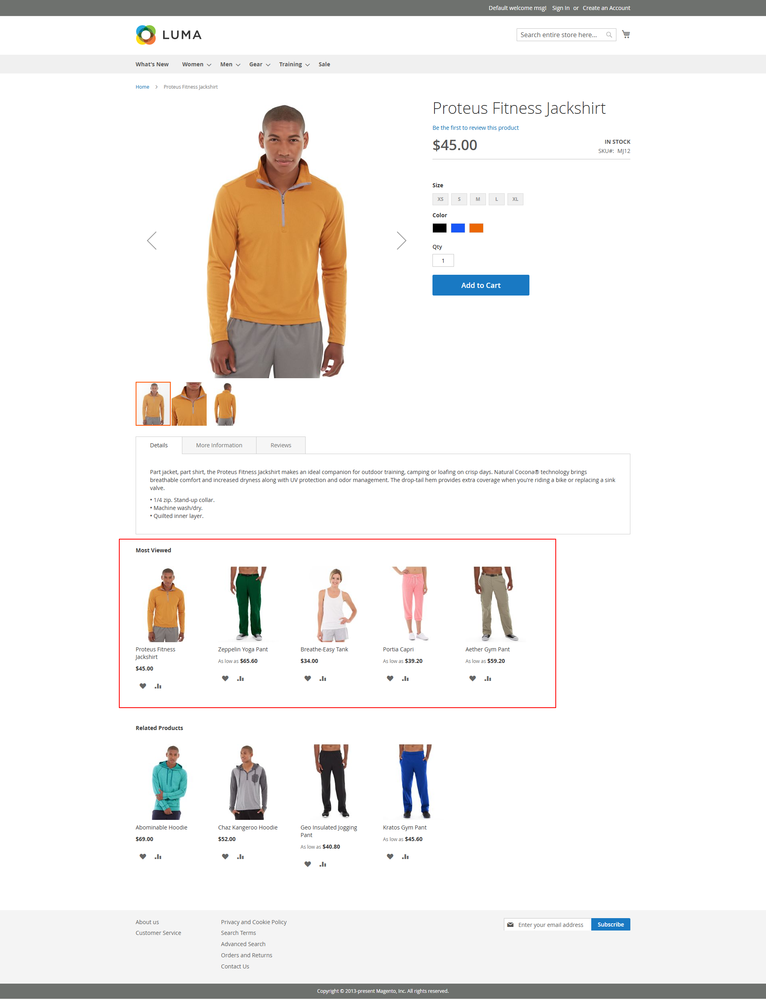

# Hrb MostViewed Magento 2 Extension

## Overview

The **Hrb MostViewed** extension for Magento 2 enables the display of the most viewed products on the product details page. This module allows store owners to showcase the most popular products based on customer views, thereby improving product visibility and increasing sales.

## Features

- Displays the most viewed products on the product details page.
- Configurable number of products to display.
- Option to enable/disable the most viewed product list.
- Configurable title for the most viewed product list.
- Customizable product image size for the most viewed products.

## Requirements

- Magento 2.4.x or later.
- PHP 7.9 or later.

## Installation

### 1. Download the Extension

Clone the repository into the `app/code/Hrb/MostViewed` directory of your Magento 2 installation.

```bash
cd /path/to/your/magento/root
git clone https://github.com/HRBHINSARA/m2-mostviewed.git app/code/
```

### 2. Enable the Module

Run the following commands to enable the module:

```bash
php bin/magento module:enable Hrb_MostViewed
php bin/magento setup:upgrade
php bin/magento setup:di:compile
php bin/magento cache:clean
```

### 3. Deploy Static Content (Production Mode Only)

If you are running in production mode, run the following command:

```bash
php bin/magento setup:static-content:deploy
```

### 4. Clear Cache

After enabling the module, clear the Magento cache:

```bash
php bin/magento cache:flush
```

## Configuration

### 1. Enable the Module

To enable the **Most Viewed** products feature, navigate to **Stores** > **Configuration** > **Catalog** > **Most Viewed Product List**.

- **Enable Notifications**: Set to **Yes** to display the most viewed products.
- **Number of products to show**: Define how many most viewed products should be displayed on the product page.
- **Product List Title**: Enter a title for the most viewed product list.

### 2. Image Size Configuration

The image size for most viewed products is defined in the `view.xml` file. You can customize the image size by modifying this file:

```xml
<image id="most_viewed_products_list" type="small_image">
    <width>152</width>
    <height>190</height>
</image>
```

## Usage

Once the module is installed and configured, it will automatically display the most viewed products on the product details page under the **Most Viewed** section. 

The **Most Viewed** products block will be displayed in the sidebar or the content area, depending on the layout you choose.

### Frontend Layout

The block of most viewed products will be added to the product detail page via the `catalog_product_view.xml` layout file. It will be shown in the `content.aside` container.

The product information includes:
- Product image
- Product name with a link to the product page
- Product price
- Add to cart and other action buttons (e.g., add to wishlist, add to compare)

### Example of Display

Here’s how the most viewed product section will appear in the frontend:



## Troubleshooting

If the most viewed products are not displaying:

1. Ensure the module is enabled in the admin panel.
2. Clear Magento cache by running `php bin/magento cache:flush`.
3. Check if the configuration values for the most viewed products are set correctly in **Stores** > **Configuration** > **Catalog** > **Catalog**.

## License

This module is released under the **MIT License**. See [LICENSE](LICENSE.md) for details.

## Contributing

If you would like to contribute to this extension, feel free to fork the repository, make changes, and submit a pull request. Please ensure that all code follows Magento 2’s coding standards and that tests are included for any new features.

